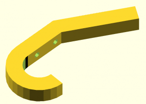
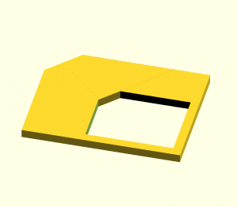
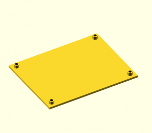
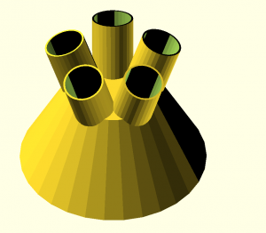
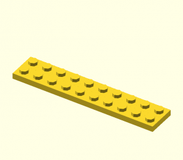
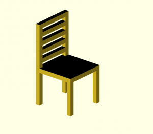
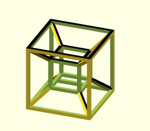
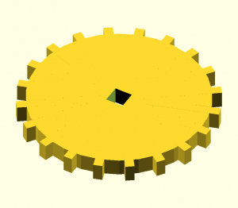
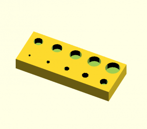
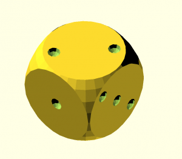

# Zadání cvičení na OpenSCAD

## Hodnocení
* Vaším úkolem je přihlásit se k úkolu pomocí tohoto linku: https://classroom.github.com/a/mvoNiBmC
  * Kompletní řešení 1 úlohy (1 bod)
  * Úloha nesplňuje zadání (0 bodů)
  * Maximální bodový zisk je 3 body, čili když uděláte více jak 3 úlohy spravně, děláte to pouze pro váš dobrý pocit.

## Možné bodové srážky 

  * Úloha musí být napsána jako modul (jinak 0 bodů)
  * Úloha nereaguje vůbec nebo reaguje nesprávně na parametr (-1/(počet parametrů úlohy) bodu)

### Úlohy

|              STL soubor                 |                  Obrázek                    |
| --------------------------------------- | ------------------------------------------- |
| [Wall hook](STLs/wall_hook.stl)         |           |
| [Snowman](STLs/snowman.stl)             |               |
| [Simcard adapter](STLs/sim.stl)         |           |
| [Plate](STLs/plate.stl)                 |                   |
| [Pen holder](STLs/pen_holder.stl)       |         |
| [Mug](STLs/mug.stl)                     |                       |
| [Lego brick](STLs/lego.stl)             |               |
| [Chair](STLs/chair.stl)                 |                   |
| [4D Hypercube](STLs/hyper_cube.stl)     |       |
| [Gear](STLs/gear.stl)                   |                     |
| [Drill stand](STLs/drill_bit_holder.stl)|  |
| [Dice](STLs/dice.stl)                   |                     |
| [Clip](STLs/clip.stl)                   |                     |
